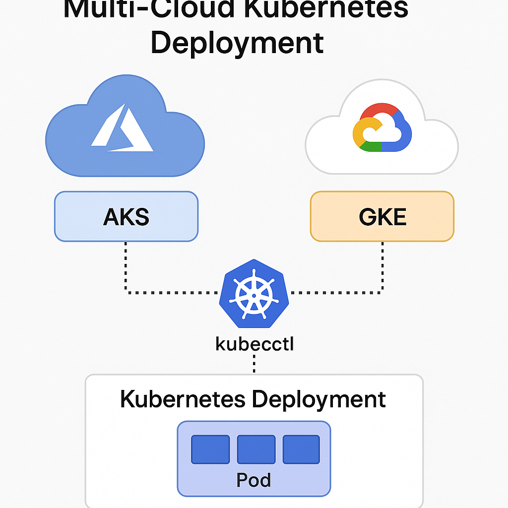

# 🌐 Multi-Cloud Kubernetes Deployment on Azure AKS and GCP GKE

This project demonstrates how to set up a multi-cloud Kubernetes environment using Azure Kubernetes Service (AKS) and Google Kubernetes Engine (GKE). It showcases Terraform-based infrastructure provisioning and a sample Kubernetes deployment.

---

## 🚀 Objectives

- Provision AKS on Azure and GKE on GCP using Terraform
- Deploy the same Kubernetes workload to both clusters
- Achieve cloud agnosticism with a consistent configuration
- Explore cost, flexibility, and redundancy of multi-cloud Kubernetes

---

## 🧰 Tech Stack

- Terraform
- Azure AKS
- GCP GKE
- Kubernetes (kubectl, manifests)
- NGINX Demo App

---

## 📂 Directory Structure

```
multicloud-k8s-azure-gcp/
├── azure/
│   └── main.tf
├── gcp/
│   └── main.tf
├── k8s/
│   └── deployment.yaml
├── images/
│   └── architecture-diagram.png
└── README.md
```

---

## ⚙️ Steps to Simulate Deployment

### Azure AKS
```bash
cd azure
terraform init
terraform apply
```

### GCP GKE
```bash
cd gcp
terraform init
terraform apply
```

### Deploy App to Kubernetes
```bash
cd k8s
kubectl apply -f deployment.yaml
```

---

## 🖼️ Architecture Diagram



---
👤 **Author:** [Rukesh Dasari](https://github.com/rukesh24)
